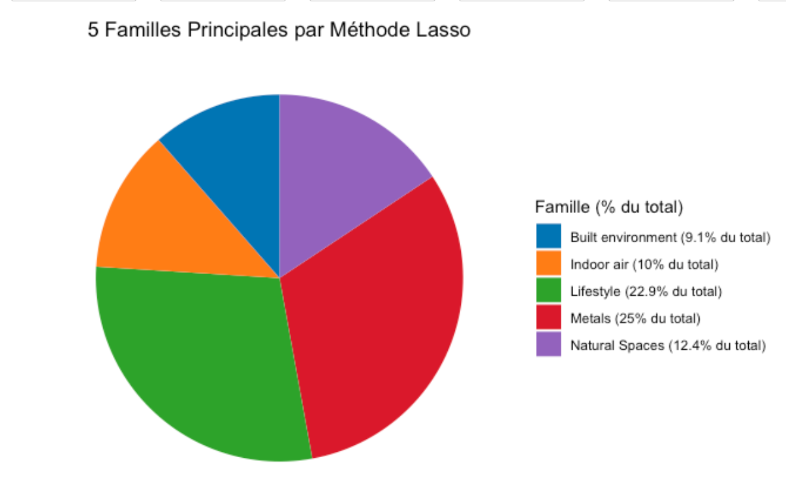

# Exposome-Wide Association Study with LASSO and Group LASSO (R)

Statistical-learning analysis of how early-life environmental exposures relate to a child health outcome. The exposures cover air pollution, built environment, metals, PFAS, pesticides, lifestyle and more.

*Student project, CentraleSupélec, June 2024. Not maintained. Notebooks are commented in French.*

## Objective
Among a large set of correlated pre- and post-natal exposures, find those associated with the child outcome `hs_Gen_Tot`, after adjusting for covariates.

## Method
1. **Pre-processing and exploratory analysis**: distributions, correlations, Cramér's V, PCA (`Traitement_donnees`, `EI_Exposomes`, `EI_Distributions`, `EI_ACP`).
2. **Covariate selection**: univariate tests, then stepwise selection with `MASS` (`Choix_Covariables`).
3. **Exposome-wide univariate regressions**: one linear model per exposure, adjusted for covariates (`EI_pvalues_Reglin`, `Exposome_Monovarie`).
4. **LASSO**: `glmnet::cv.glmnet` at λ_min, with covariates forced into the model (`EI_pvalue_Lasso`, `Exposome_Lasso`).
5. **Group LASSO**: `gglasso`, with groups given by exposure family (`GroupLasso`).
6. Breakdown of the selected exposures by family, sub-family and period (pregnancy vs. postnatal).

## Results
| Model | R² | RMSE | MAE |
|---|---|---|---|
| Linear regression (univariate pipeline) | 0.161 | 0.821 | 0.628 |
| LASSO | 0.310 | 15.80 | 11.94 |

Metrics are in-sample (computed on the training data).

The exposure families most often selected by LASSO are metals (6), built environment (4), lifestyle (4) and air pollution (3). Full tables are in `results/` and charts in `figures/`.



## Getting started
The dataset is **not** included. Put `exposome.RData` (with the `exposome`, `covariates` and `phenotype` tables) in `data/`, then knit the notebooks in `notebooks/`.

```r
install.packages(c("dplyr","ggplot2","glmnet","gglasso","MASS","corrplot","vcd",
                   "RColorBrewer","broom","tibble","tidyr","readr","stringr","pacman"))
```

## Credits
[TODO: team members]
